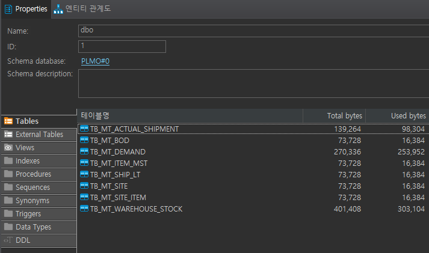
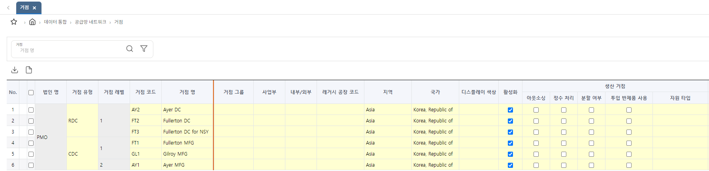

# Interface IM/RP

```
풀무원 PoC 기준 (MSSQL)
```

## 진행 과정
> 1. Excel to DB (Meta Table Data) <br>
> 2. Meta to IF Table <br>
> 3. CM 데이터 일괄 생성 <br>
    1) 일반 설정 (CM - GENERAL) <br>
    2) 거점 (LOCATION = SITE) <br>
    3) 품목 (ITEM) <br>
    4) 거점 품목 (SITE_ITEM) <br>
    5) 거점 BOD (SITE_BOD) <br>
    6) 출하 LT (SHIPMENT_LT) <br>
    7) 글로벌 계획 BOM (LOC_BOD_MAP) <br>
    8) 거점 수송 (TRANSPORTATION)
> 4. IM 데이터 일괄 생성 <br>
    1) DP 버전 생성 <br>
    2) RP 버전 생성 <br>
    3) 일반 설정 (IM - GENERAL) <br>
    4) 출하 실적 (ACTUAL_SHIPMENT) <br>
    5) ABC 분석 (SABC) <br>
    6) 공급 변동성 (SUPPLY_VARIABILITY) <br>
    7) 수요 변동성 (DEMAND_VARIABILITY) <br>
    8) 재고 정책 기준 (INVENTORY_POLICY) <br>
    9) 재고 정책 상세 (INVENTORY_POLICY_DETAIL) <br>
> 5. Demand 생성


### 1. Excel to DB (Meta Table)

> (1) Data 준비 <br><br>
>  <br><br>
> (2) Table Insert 파일 생성 <br><br>
>  <br>
> ex) TB_MT_SITE, TB_MT_SITE_ITEM, TB_MT_BOD... <br><br>
> (3) Data Import
> - 우클릭 > 태스크 > 데이터 가져오기 <br>
>  <br>
> - 데이터 원본 선택 - 엑셀 파일 선택 <br>
>  <br>
> - 대상 선택 - DB 선택 <br>
>  <br>
> PoC DB Name = DBName#0 <br>
> ex) PMO#0 <br><br>
> - Meta Table & Data 생성 완료 <br>
> 

<br>

### 2. Meta Table Data to IF Table

> Meta Table Data -> IF Table <br><br>
> 

<br>

### 3. CM 데이터 일괄 생성 (Batch Procedure) <br>
> (1) 일반 설정 (CM - GENERAL) <br><br>
    * 공급망 모델 - 법인 (TB_CM_CORPORATION)
>  <br><br>
    * 공급망 모델 - 거점 유형/레벨 (TB_CM_LOC_MST)
>  <br><br>
    * 공급망 모델 - BOD 리드타임 구간 (TB_CM_BOD_LT, TB_CM_VEHICLE)
>  <br><br>
    - IF table : X <br>
    - T3SmartSCM Table : TB_CM_CONFIGURATION, TB_AD_COMN_CODE <br>
    - Batch : X <br>
    - Execute : X

> (2) 거점 (LOCATION = SITE) <br><br>
>  <br>
    - IF table : TB_IF_SITE <br>
    - T3SmartSCM Table : TB_CM_LOC_DTL, TB_CM_LOC_MGMT <br>
    - Batch : SP_UI_CM_02_BATCH <br>
    - Execute : EXEC SP_UI_CM_02_BATCH 'N', 'N', '', 'Y', 'admin';

> (3) 품목 (ITEM) <br><br>
>  <br>
    - IF table : X <br>
    - T3SmartSCM Table : TB_CM_ITEM_MST<br>
    - Batch : X <br>
    - Execute : X

> (4) 거점 품목 (SITE_ITEM) <br><br>
>  <br>
    - IF table : TB_IF_SITE_ITEM <br>
    - T3SmartSCM Table : TB_CM_SITE_ITEM <br>
    - Batch : SP_UI_CM_04_BATCH <br>
    - Execute : EXEC SP_UI_CM_04_BATCH 'Y', 'N', '', 'N', '', 'Y', 'admin';

> (5) 거점 BOD (SITE_BOD) <br><br>
>  <br>
    - IF table : TB_IF_BOD <br>
    - T3SmartSCM Table : TB_CM_LOC_BOD_MAP <br>
    - Batch : SP_UI_CM_06_BATCH <br>
    - Execute : EXEC SP_UI_CM_06_BATCH 'ALL', 'N', '', 'Y', 'admin';

> (6) 출하 LT (SHIPMENT_LT) <br><br>
>  <br>
    - IF table : X <br>
    - T3SmartSCM Table : TB_CM_SHIP_LT_MST, TB_CM_SHIP_LT_DTL <br>
    - Batch : SP_UI_CM_07_BATCH <br>
    - Execute : EXEC SP_UI_CM_07_BATCH 'ALL', 'N', '', 'Y', 'admin';

> (7) 글로벌 계획 BOM (LOC_BOD_MAP) <br><br>
>  <br>
    - IF table : X <br>
    - T3SmartSCM Table : TB_CM_GLOBAL_PLAN_BOM <br>
    - Batch : SP_UI_CM_11_BATCH <br>
    - Execute : EXEC SP_UI_CM_11_BATCH 'ALL', 'N', '', 'N', '', 'Y', 'admin';

> (8) 거점 수송 (TRANSPORTATION) <br><br>
>  <br>
    - IF table : X <br>
    - T3SmartSCM Table : TB_CM_TRANSFER_MGMT_MST, TB_CM_TRANSFER_MGMT_DTL <br>
    - Batch : SP_UI_CM_10_BATCH <br>
    - Execute : EXEC SP_UI_CM_10_BATCH 'ALL', 'N', '', 'N', '', '', '', 'Y', 'admin';

<br>

### 4. IM 데이터 일괄 생성 (Batch Procedure) <br>
> (1) DP 버전 생성 <br>
    - TB_DP_CONTROL_BOARD_VER_MST

> (2) RP 버전 생성 <br>
    - 계획 시나리오 (TB_CM_PLAN_SNRIO_MGMT_MST, TB_CM_PLAN_SNRIO_MGMT_DTL) <br>
    - 계획 정책 (TB_CM_PLAN_POLICY_MST, TB_CM_PLAN_POLICY_DTL, TB_CM_PLAN_POLICY_MGMT) <br>
    - 보충 계획 시뮬레이션 (TB_CM_CONBD_MAIN_VER_MST, TB_CM_HORIZON_TIME_BUCKET)

> (3) 일반 설정 (IM - GENERAL) <br><br>
    * 재고 계획 - 수요 변동성 분석 판매계획/출하실적 구간 설정
>  <br><br>
    * 재고 계획 - 재고등급 분석 분석 판매계획/출하실적 구간 설정
>  <br><br>
    * 재고 계획 - 재고 등급 정의
>  <br><br>
    * 재고 계획 - 재고관리 분류 기준 - 재고등급 (SABC) 설정
>  <br><br>
    * 재고 계획 - 목표 서비스 수준 산출 기준
>  <br><br>
    * 재고 계획 - 공급 변동성 리드타임 실적 기준 설정
>  <br><br>
    * 재고 계획 - 평균 공급 리드타임 산출식 결정
>  <br><br>
    * 재고 계획 - 평균 운송비용 산출식 설정
>  <br><br>
    * 재고 계획 - 수요율 산출 출하실적 구간 설정
>  <br><br>
    * 재고 계획 - 수요율 산출 계산 방식 설정
>  <br><br>
    * 재고 계획 - 경제량 주문량 산출식 설정
>  <br><br>

> (4) 출하 실적 (ACTUAL_SHIPMENT) <br><br>
>  <br>
    - IF table : TB_IF_ACTUAL_SHIPMENT <br>
    - T3SmartSCM Table : TB_CM_ACTUAL_SHIPMENT <br>
    - Batch : SP_UI_IM_01_BATCH <br>
    - Execute : EXEC SP_UI_IM_01_BATCH 'ALL', 'Y', 'admin';

> (5) ABC 분석 (SABC) <br><br>
>  <br>
    - IF table : X <br>
    - T3SmartSCM Table : TB_IM_SABC_ANALYSIS_MST, TB_IM_SABC_ANALYSIS_DTL <br>
    - Batch : SP_UI_IM_08_BATCH <br>
    - Execute : EXEC SP_UI_IM_08_BATCH 'ALL', 'Y', 'admin';

> (6) 공급변동성 (SUPPLY_VARIABILITY) <br><br>
>  <br>
    - IF table : X <br>
    - T3SmartSCM Table : TB_IM_SPPLY_VARAN_ANLYS_MST, TB_IM_SPPLY_VARAN_ANLYS_DTL <br>
    - Batch : SP_UI_IM_10_BATCH <br>
    - Execute : EXEC SP_UI_IM_10_BATCH 'ALL', 'Y', 'admin';

> (7) 수요변동성 (DEMAND_VARIABILITY) <br><br>
>  <br>
    - IF table : X <br>
    - T3SmartSCM Table : TB_IM_DMND_VARAN_ANLYS_MST, TB_IM_DMND_VARAN_ANLYS_DTL <br>
    - Batch : SP_UI_IM_09_BATCH <br>
    - Execute : EXEC SP_UI_IM_09_BATCH 'ALL', 'Y', 'admin';

> (8) 재고 정책 기준 (INVENTORY_POLICY) <br><br>
>  <br>
TARGET_INV_SFST_CONSID_YN : true <br>
TARGET_INV_OPERT_INV_CONSID_YN : true <br><br>
    - IF table : X <br>
    - T3SmartSCM Table : TB_IM_INV_POLICY_MST, TB_IM_INV_POLICY_GRADE_MST <br>
    - Batch : SP_UI_IM_25_BATCH <br>
    - Execute : EXEC SP_UI_IM_25_BATCH 'ALL', 'Y', 'admin';

> (9) 재고 정책 상세 (INVENTORY_POLICY_DETAIL) <br><br>
>  <br>
    - IF table : X <br>
    - T3SmartSCM Table : TB_IM_SPPLY_VARAN_ANLYS_MST, TB_IM_SPPLY_VARAN_ANLYS_DTL <br>
    - Batch : SP_UI_IM_10_BATCH <br>
    - Execute : EXEC SP_UI_IM_10_BATCH 'ALL', 'Y', 'admin';

<br>

### 5. Demand 생성 <br>
> Demand 생성 (DEMAND_OVERVIEW) <br><br>
>  <br>
    - IF table : TB_IF_DEMAND <br>
    - T3SmartSCM Table : TB_CM_DEMAND_OVERVIEW <br>
    - Batch : SP_UI_MP_19_BATCH <br>
    - Execute : EXEC SP_UI_MP_19_BATCH 'ALL', 'Y', 'admin';