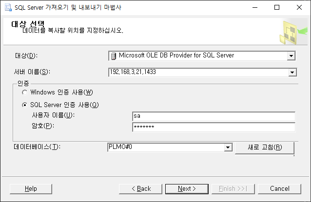

# Interface MP

```
대동기계 PoC 기준 (MSSQL)
```

## 진행 과정
> 1. Excel to DB (Meta Table Data)  <br>
> 2. Meta Table to IF Table <br>
> 3. CM 데이터 일괄 생성 <br>
    1) 일반 설정 (CM - GENERAL) <br>
    2) 거점 (LOCATION = SITE) <br>
    3) 품목 (ITEM) <br>
    4) 거점 품목 (SITE_ITEM) <br>
    5) 글로벌 생산 BOM (BOM) <br>
    6) 창고 재고 (WAREHOUSE_STOCK)
> 4. MP 데이터 일괄 생성 <br>
    1) 자원 (RESOURCE) <br>
    2) 품목 기준 자원 순위 (BOR) <br>
    3) 품목 기준 자원 생산능력 ()
> 5. Demand 생성


### 1. Excel to DB (Meta Table)

> (1) Data 준비 <br><br>
>  <br>
> ex) TB_MT_SITE, TB_MT_SITE_ITEM, TB_MT_BOM... <br><br>
> (2) Data Import
> - 우클릭 > 태스크 > 데이터 가져오기 <br>
>  <br>
> - 데이터 원본 선택 - 엑셀 파일 선택 <br>
>  <br>
> - 대상 선택 - DB 선택 <br>
>  <br>
> PoC DB Name = DBName#0 <br>
> ex) PMO#0 <br><br>
> - Meta Table & Data 생성 완료 <br>
> 

<br>

### 2. Meta Table Data to IF Table

> Meta Table Data -> IF Table <br><br>
> 

<br>

### 3. CM 데이터 일괄 생성 (Batch Procedure) <br>
> (1) 일반 설정 (CM - GENERAL) <br><br>
    * 공급망 모델 - 법인 (TB_CM_CORPORATION)
>  <br><br>
    * 공급망 모델 - 거점 유형/레벨 (TB_CM_LOC_MST)
>  <br><br>
    * 공급망 모델 - BOD 리드타임 구간 (TB_CM_BOD_LT, TB_CM_VEHICLE)
>  <br><br>
    - IF table : X <br>
    - T3SmartSCM Table : TB_CM_CONFIGURATION, TB_AD_COMN_CODE <br>
    - Batch : X <br>
    - Execute : X

> (2) 거점 (LOCATION = SITE) <br><br>
>  <br>
    - IF table : TB_IF_SITE <br>
    - T3SmartSCM Table : TB_CM_LOC_DTL, TB_CM_LOC_MGMT <br>
    - Batch : SP_UI_CM_02_BATCH <br>
    - Execute : EXEC SP_UI_CM_02_BATCH 'N', 'N', '', 'Y', 'admin';

> (3) 품목 (ITEM) <br><br>
>  <br>
    - IF table : X <br>
    - T3SmartSCM Table : TB_CM_ITEM_MST<br>
    - Batch : X <br>
    - Execute : X

> (4) 거점 품목 (SITE_ITEM) <br><br>
>  <br>
    - IF table : TB_IF_SITE_ITEM <br>
    - T3SmartSCM Table : TB_CM_SITE_ITEM <br>
    - Batch : SP_UI_CM_04_BATCH <br>
    - Execute : EXEC SP_UI_CM_04_BATCH 'Y', 'N', '', 'N', '', 'Y', 'admin';

> 글로벌 생산 BOM (BOM) <br><br>
>  <br>
    - IF table : TB_IF_BOD <br>
    - T3SmartSCM Table : TB_CM_LOC_BOD_MAP <br>
    - Batch : SP_UI_CM_06_BATCH <br>
    - Execute : EXEC SP_UI_CM_06_BATCH 'ALL', 'N', '', 'Y', 'admin';;

<br>

### 4. MP 데이터 일괄 생성 (Batch Procedure) <br>

<br>

### 5. Demand 생성 <br>
> Demand 생성 (DEMAND_OVERVIEW) <br><br>
>  <br>
    - IF table : TB_IF_DEMAND <br>
    - T3SmartSCM Table : TB_CM_DEMAND_OVERVIEW <br>
    - Batch : SP_UI_MP_19_BATCH <br>
    - Execute : EXEC SP_UI_MP_19_BATCH 'ALL', 'Y', 'admin';